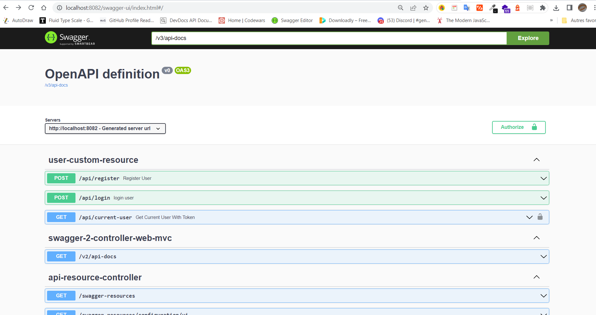

# spring-boot-test-apis

This project is made to secure access APIs resource with Spring Security
and to test them with Swagger-ui OpenApi Client.

Please, I use an Online Mysql Database to store all the data.So, you will
provide an url, username and password in **application.yml** file before execution
otherwise the application will go wrong.

Then to execute the application , run command like :

`mvnm install` to create jar file

`java -jar ./target/spring-boot-test-apis-0.0.1-SNAPSHOT.jar` to lauch application server api

and to visualize all APIs, copy and past request inside browser:
`http://localhost:8082/swagger-ui/index.html`

